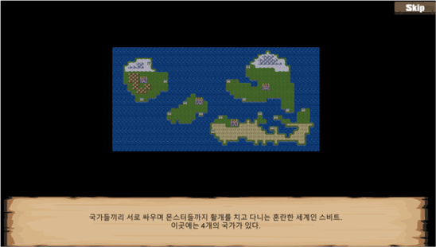
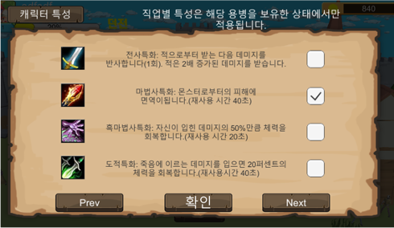
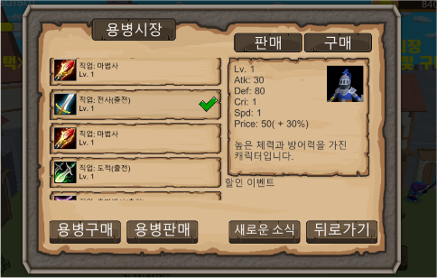
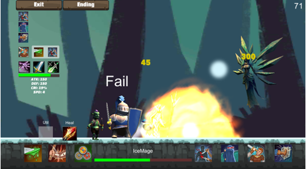
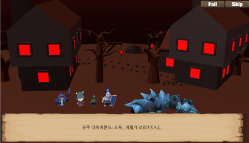

# Final Episode

모바일 RPG 게임

           

### Contents
1. 개요
2. 프로그램 기본 구조
3. 기능별 상세내역

### 1. 개요

- 용병을 고용&육성해서 스테이지를 단계별로 공략해나가는 플레이방식
- 서로 다른 특성스킬을 가진 용병들을 각 스테이지의 특성에 맞게 잘 조합하여 공략을 유도
- 고정된 가격으로 용병을 고용 혹은 인게임 내 특정 이벤트 발생 시 더 저렴한 가격에 고용할 수 있고 혹은 이에 따라 더 비싼 가격으로 판매도 가능하도록 구현

<>

### 2. 프로그램 기본 구조

#### (1) 유저정보
- JSON 형식으로 입출력
- 유저 기본 정보 관리(유저이름 및 보유 재화량)
- 계정의 게임 데이터 관리(보유용병 목록, 튜토리얼 클리어 여부)

#### (2) 인게임 데이터 관리
- 게임 기초 데이터 관리(각 용병들의 가격, 스테이지별 출현 몬스터 및 몬스터의 능력치 등)
- csv파일로 관리
- 읽은 csv파일을 C#의 Dictionary자료구조에 저장
- 해당 데이터를 항상 같은 인스턴스에서 참조할 수 있도록 싱글턴 객체로 구현
- 데이터 변경 시 저장 및 불러오기 기능

#### (3) 용병 고용 기능
- 파싱된 게임의 기초 데이터를 바탕으로 마을의 훈련소에서 용병 관련 정보 제공 및 고용가능하도록  구현
- 고용 전 재화량 체크 및 고용 후 게임 내 유저별 용병리스트에 반영

#### (4) 특성스킬 관리
- 파싱된 게임의 기초 데이터를 바탕으로 UI에 스킬별 설명 표시
- 특성스킬 선택 시 전투씬에서 해당 능력 반영

#### (5) 전투 시스템
- 현재 유저가 보유중인 용병리스트 중 선택한 3명의 용병의 데이터를 기반으로 전투씬 초기화
- 선택된 스테이지의 데이터로 몬스터의 외형과 능력치, 패턴 초기화
- 스킬 및 전투 정보 관련 UI 구현
- 전체 전투 방식 구현(횡 이동, 적이 사용하는 스킬에 대응 후 공격하여 몬스터를 쓰러뜨리는 방식)
- 전투 결과 처리

#### (6) 보유용병 판매 및 특정 용병 관련 구매 이벤트 기능
- 마을에 들어왔을 때 특정 용병을 저렴하게 구매/비싸게 판매할 수 있는 이벤트 시스템
- 현재 유저의 레벨에 맞춰서 출현 용병의 레벨 조정
- 용병의 레벨에 맞게 가격 변동 기능

#### (7) 컷씬
- 타이틀 화면에서 파싱한 데이터로 해당 상황에 맞는 컷씬을 보여주는 방식으로 스토리 구현
- 컷씬의 시작과 종료는 FadeIn-FadeOut 방식으로 연출(Unity의 코루틴 기능 활용)
- 컷씬의 텍스트는 TypeWrite효과를 적용하여 연출(Unity의 코루틴 기능 활용)
- 스킵 기능
- 연출에 필요한 데이터 형식 추가 및 해당 데이터들에 맞게 오브젝트들의 움직임을 순서대로 보여줄 수 있도록 구현

### 3. 기능별 상세내역
### (1) 타이틀 화면

- 타이틀 이미지 떨어지는 연출
- Start 버튼 클릭 시 게임 첫실행 여부를 체크하여 오프닝 씬을 로딩할지 마을씬으로 바로 로딩할지 결정
- Option: 사운드 음량 조절 기능

### (2) 오프닝 씬

- 게임의 시작 스토리 설명
- 설정된 데이터의 순서에 따라 보여줄 오브젝트 및 움직임 등의 연출

### (3) 로비 씬

- 기본 ui: 유저 이름, 레벨, 경험치, 골드 보유량 표시
- 텍스트로 표시된(ex.훈련소, 던전) 오브젝트 터치 시 해당 컨텐츠 표시
- 게임 첫 실행 시 튜토리얼 실행

### (4) 캐릭터 관리

- 현재 유저가 보유중인 용병 목록 표시
- 좌측 용병 목록 터치 시, 해당 용병의 상세정보를 우측에 표시(레벨 등)
- 전투에 사용할 용병 선택 기능

### (5) 용병 고용

- 직업별 용병 고용 기능
- 좌측 용병 목록 터치 시 터치된 용병의 상세 능력치와 설명을 우측에 표시
- 보유 골드량 체크하여 구매 가능 여부 표시

### (6) 용병 특성 스킬

- 각 용병별로 다른 특성 스킬제공
- 각 특성스킬은 해당 용병이 전투 출전 리스트에 포함되었을때만 사용할 수 있도록 구현

### (7) 용병 시장

- 마을 씬에 들어올때마다(ex. 전투가 끝나고 마을로 돌아왔을 때, 게임을 실행하여 마을로 들어왔을 때) 특정 용병의 판매, 구매와 관련한 이벤트 갱신
- 현재 보유중인 용병의 판매 기능 및 구매 가능한 용병의 목록 제공
- 진행중인 이벤트에 따라 용병의 구매/판매 가격 변동
- '새로운 소식' 버튼을 터치하여 어떤 용병을 타겟으로 이벤트가 진행될지 확인 가능

### (8) 던전 정보

- 유저 데이터를 기반으로 현재 플레이어가 클리어한 스테이지의 목록과 최대 클리어 스테이지보다 1단계 위의 스테이지 표시
- 스테이지 별 상세정보를 게임 기초데이터로 초기화하여 표시

### (9) 전투

- 선택한 용병 리스트를 바탕으로 UI갱신, 모델링 프리팹 생성
- 선택한 스테이지의 몬스터 정보 셋팅
- 기본적인 전투 프로세스(횡스크롤 방식으로 자동으로 오른쪽으로 이동 - 적 발견 - 전투 시작 - 전투 종료 및 결과 표시)
- 용병과 몬스터 모두 피격 시 데미지 수치를 표시(딜링: 노란색/힐링: 초록색)
- 딜링방식: 좌측 하단의 버튼으로 스킬을 사용하기 위한 자원을 수급, 자원이 충분히 차면 오른쪽 하단의버튼으로 스킬을 사용하여 적에게 딜링
- 출전한 용병들의 스텟을 합산하여 데미지에 반영
- 각 용병들은 공격형, 방어형, 치유형 방식으로 특화되어 있어 스테이지를 공략하는 방식에 선택지를 부여

### (10) 엔딩

- 클리어 성공/ 실패/ hp가 50% 이상인 상태에서 클리어, 3가지 경우에 따라 다른 엔딩이 나오도록 구현
- 연출을 편하게 작업할 수 있도록 연출 데이터를 관리하는 클래스의 인스펙터를 커스터마이징하여 데이터를 더 편하게 삽입/삭제 기능 추가

